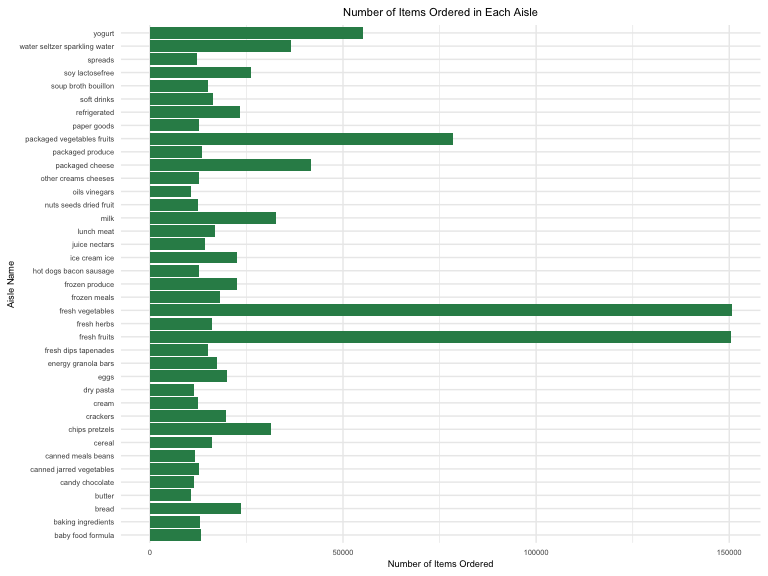
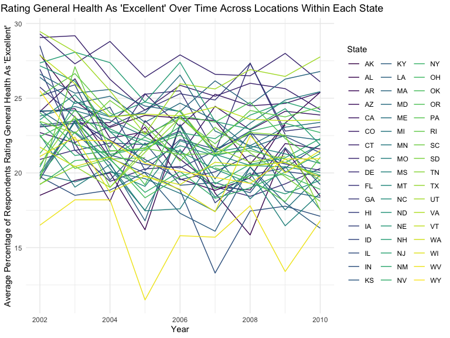
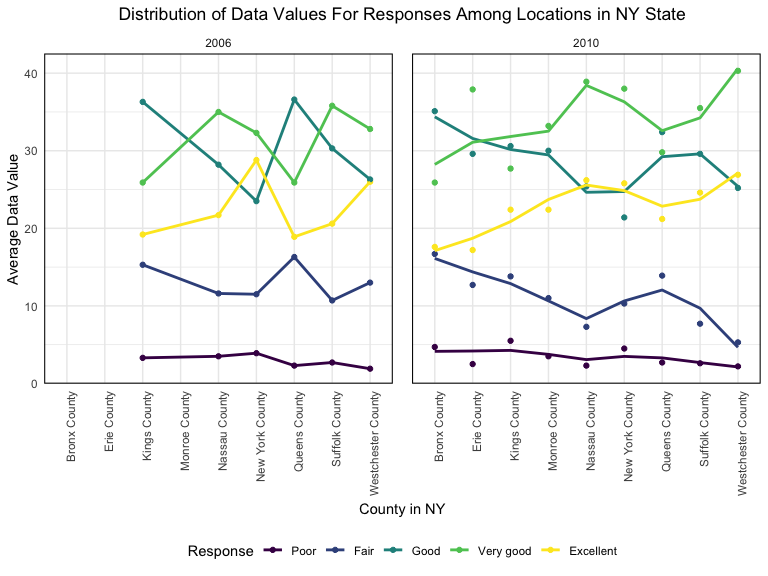
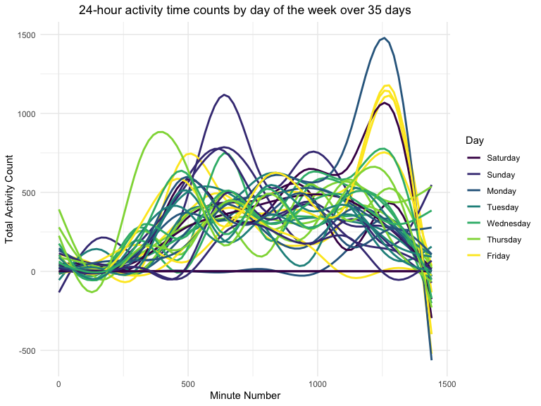

p8105\_hw3\_at3346
================
Ashley Tseng
10/14/2019

## Problem 1

Load data:

``` r
data("instacart") 
force(instacart)
```

    ## # A tibble: 1,384,617 x 15
    ##    order_id product_id add_to_cart_ord… reordered user_id eval_set
    ##       <int>      <int>            <int>     <int>   <int> <chr>   
    ##  1        1      49302                1         1  112108 train   
    ##  2        1      11109                2         1  112108 train   
    ##  3        1      10246                3         0  112108 train   
    ##  4        1      49683                4         0  112108 train   
    ##  5        1      43633                5         1  112108 train   
    ##  6        1      13176                6         0  112108 train   
    ##  7        1      47209                7         0  112108 train   
    ##  8        1      22035                8         1  112108 train   
    ##  9       36      39612                1         0   79431 train   
    ## 10       36      19660                2         1   79431 train   
    ## # … with 1,384,607 more rows, and 9 more variables: order_number <int>,
    ## #   order_dow <int>, order_hour_of_day <int>,
    ## #   days_since_prior_order <int>, product_name <chr>, aisle_id <int>,
    ## #   department_id <int>, aisle <chr>, department <chr>

``` r
instacart %>% 
  filter(order_hour_of_day == "23") %>% 
  count (product_name, name = "n_latenight")
```

    ## # A tibble: 6,516 x 2
    ##    product_name                                    n_latenight
    ##    <chr>                                                 <int>
    ##  1 "\\\"Darn Good\\\" Chili Mix"                             1
    ##  2 0 Calorie Acai Raspberry Water Beverage                   1
    ##  3 0 Calorie Fuji Apple Pear Water Beverage                  2
    ##  4 0 Calorie Strawberry Dragonfruit Water Beverage           1
    ##  5 0% Fat Free Organic Milk                                  7
    ##  6 0% Fat Superfruits Greek Yogurt                           1
    ##  7 0% Greek Strained Yogurt                                  2
    ##  8 0% Greek, Blueberry on the Bottom Yogurt                  2
    ##  9 1 Apple + 1 Mango Fruit Bar                               2
    ## 10 1 Apple + 1 Pear Fruit Bar                                1
    ## # … with 6,506 more rows

``` r
n_aisle = instacart %>% 
  count(aisle)
```

The `instacart` dataset contains 1384617 observations (representing
products from orders) of 131209 unique users and 15 variables. There is
a single order per user in this dataset. Key variables in the
`instacart` dataset include `reordered`, which describes if this product
has been ordered by this user in the past,`order_dow`, which describes
the day of the week on which the order was placed, and
`order_hour_of_day`, which describes the hour of the day on which the
order was placed. For example, `user_id` 18 ordered 2 items (Organic
Strawberries and Small Hass Avocado) from the fresh fruits aisle, both
of which were reordered items. Another example is that the most ordered
items at 11:00 pm from Instacart are “Banana,” “Bag of Organic Bananas,”
“Organic Strawberries,” and “Organic Baby Spinach,” which is surprising
given that I would expect more unhealthy food to be ordered late at
night.

There are 134 total aisles included in the `instacart` dataset. The
aisles that the most items are ordered from are “fresh vegetables”
(150609 orders) and “fresh fruit” (150473 orders).

Make a table showing the three most popular items in each of the aisles
“baking ingredients”, “dog food care”, and “packaged vegetables
fruits”:

``` r
n_ordered = n_aisle %>% 
  filter(n > 10000) %>% 
  ggplot(aes(x = aisle, y = n)) +
  geom_bar(stat = "identity", fill = "sea green") +
  coord_flip() +
  labs(
    title = "Number of Items Ordered in Each Aisle",
    x = "Aisle Name",
    y = "Number of Items Ordered") +
  theme(
    legend.position = "none",
    plot.title = element_text(hjust = 0.5),
    text = element_text(size = 7))

n_ordered
```



Make a table showing the mean hour of the day at which Pink Lady Apples
and Coffee Ice Cream are ordered on each day of the week:

``` r
table_popitems = instacart %>% 
  filter(aisle == "baking ingredients" | aisle == "dog food care" | aisle == "packaged vegetables fruits") %>%
  mutate(aisle = toTitleCase(aisle)) %>% 
  group_by(aisle) %>%
  count(product_name, name = "n_prod") %>% 
  filter(dense_rank(desc(n_prod)) < 4) %>% 
  arrange(desc(n_prod)) %>% 
  rename (
  "Aisle" = aisle,
  "Product Name" = product_name,
  "Number of Times Ordered" = n_prod) 

table_popitems %>% 
  knitr::kable()
```

| Aisle                      | Product Name                                  | Number of Times Ordered |
| :------------------------- | :-------------------------------------------- | ----------------------: |
| Packaged Vegetables Fruits | Organic Baby Spinach                          |                    9784 |
| Packaged Vegetables Fruits | Organic Raspberries                           |                    5546 |
| Packaged Vegetables Fruits | Organic Blueberries                           |                    4966 |
| Baking Ingredients         | Light Brown Sugar                             |                     499 |
| Baking Ingredients         | Pure Baking Soda                              |                     387 |
| Baking Ingredients         | Cane Sugar                                    |                     336 |
| Dog Food Care              | Snack Sticks Chicken & Rice Recipe Dog Treats |                      30 |
| Dog Food Care              | Organix Chicken & Brown Rice Recipe           |                      28 |
| Dog Food Care              | Small Dog Biscuits                            |                      26 |

Make a table showing the mean hour of the day at which Pink Lady Apples
and Coffee Ice Cream are ordered on each day of the week:

``` r
table_meanhr = instacart %>% 
  filter(product_name == "Pink Lady Apples" | product_name == "Coffee Ice Cream") %>% 
  mutate(
    order_dow = recode(order_dow, "0" = "Sunday", "1" = "Monday", "2" = "Tuesday", 
                       "3" = "Wednesday", "4" = "Thursday", "5" = "Friday", "6" = "Saturday"),
    order_dow = ordered(order_dow, c("Sunday", "Monday", "Tuesday", "Wednesday", "Thursday", "Friday", "Saturday"))                   
    ) %>% 
  group_by(product_name, order_dow) %>% 
  summarize(mean_hrordered = round(mean(order_hour_of_day), digits = 2)) %>% 
  separate(mean_hrordered, into = c("hour", "minute"), sep = "[.]") %>% 
  mutate(
    hour = as.numeric(hour),
    minute = as.numeric(minute),
    hour = case_when(
      hour > 12 ~ (hour - 12),
      hour <= 12 ~ hour),
    minute = round((minute/100)*60),
    minute = str_pad(minute, 2, pad = "0"),
    time = paste(hour, minute, sep = ":"),
    time = case_when(
      grepl("11", time) ~ (paste(time, 'am')),
      time < 11 ~ (paste(time, 'pm')),
      time > 12 ~ (paste(time, 'pm')))
    ) %>% 
    select(-c("hour", "minute")) %>% 
  pivot_wider(
    names_from = order_dow,
    values_from = time
  ) %>% 
  rename ("Product Name" = product_name) 

table_meanhr %>% 
  knitr::kable()
```

| Product Name     | Sunday  | Monday   | Tuesday  | Wednesday | Thursday | Friday   | Saturday |
| :--------------- | :------ | :------- | :------- | :-------- | :------- | :------- | :------- |
| Coffee Ice Cream | 1:46 pm | 2:19 pm  | 3:23 pm  | 3:19 pm   | 3:13 pm  | 12:16 pm | 1:50 pm  |
| Pink Lady Apples | 1:26 pm | 11:22 am | 11:04 am | 2:15 pm   | 11:33 am | 12:47 pm | 11:56 am |

## Problem 2

Data cleaning:

``` r
data("brfss_smart2010") 
force(brfss_smart2010)
```

    ## # A tibble: 134,203 x 23
    ##     Year Locationabbr Locationdesc Class Topic Question Response
    ##    <int> <chr>        <chr>        <chr> <chr> <chr>    <chr>   
    ##  1  2010 AL           AL - Jeffer… Heal… Over… How is … Excelle…
    ##  2  2010 AL           AL - Jeffer… Heal… Over… How is … Very go…
    ##  3  2010 AL           AL - Jeffer… Heal… Over… How is … Good    
    ##  4  2010 AL           AL - Jeffer… Heal… Over… How is … Fair    
    ##  5  2010 AL           AL - Jeffer… Heal… Over… How is … Poor    
    ##  6  2010 AL           AL - Jeffer… Heal… Fair… Health … Good or…
    ##  7  2010 AL           AL - Jeffer… Heal… Fair… Health … Fair or…
    ##  8  2010 AL           AL - Jeffer… Heal… Heal… Do you … Yes     
    ##  9  2010 AL           AL - Jeffer… Heal… Heal… Do you … No      
    ## 10  2010 AL           AL - Jeffer… Heal… Unde… Adults … Yes     
    ## # … with 134,193 more rows, and 16 more variables: Sample_Size <int>,
    ## #   Data_value <dbl>, Confidence_limit_Low <dbl>,
    ## #   Confidence_limit_High <dbl>, Display_order <int>,
    ## #   Data_value_unit <chr>, Data_value_type <chr>,
    ## #   Data_Value_Footnote_Symbol <chr>, Data_Value_Footnote <chr>,
    ## #   DataSource <chr>, ClassId <chr>, TopicId <chr>, LocationID <chr>,
    ## #   QuestionID <chr>, RESPID <chr>, GeoLocation <chr>

``` r
brfss_smart2010 = brfss_smart2010 %>% 
  janitor::clean_names() %>% 
  filter(
    topic == "Overall Health",
    response == "Excellent" | response == "Very good" | response == "Good" | response == "Fair" | response == "Poor") %>% 
  mutate(response = ordered(response, c("Poor", "Fair", "Good", "Very good", "Excellent")))
```

In 2002, which states were observed at 7 or more locations? What about
in 2010?

``` r
seven_2002 = brfss_smart2010 %>% 
  filter(year == "2002") %>% 
  separate(locationdesc, into = c("state", "county"), sep = 4) %>% 
  select(-c("state")) %>% 
  rename("state" = locationabbr) %>% 
  group_by(state) %>%
  summarize(n_loc = n_distinct(county)) %>% 
  filter(n_loc > 6) %>% 
  arrange(desc(n_loc)) 


seven_2010 = brfss_smart2010 %>% 
  filter(year == "2010") %>% 
  separate(locationdesc, into = c("state", "county"), sep = 4) %>% 
  select(-c("state")) %>% 
  rename("state" = locationabbr) %>% 
  group_by(state) %>%
  summarize(n_loc = n_distinct(county)) %>% 
  filter(n_loc > 6) %>% 
  arrange(desc(n_loc)) 
```

In 2002, CT, FL, MA, NC, NJ, and PA were observed at 7 or more
locations. In 2010, CA, CO, FL, MA, MD, NC, NE, NJ, NY, OH, PA, SC, TX,
and WA were observed at 7 or more locations.

Make a “spaghetti” plot of this average value over time within a state:

``` r
spaghetti = brfss_smart2010 %>% 
  filter(response == "Excellent") %>% 
  separate(locationdesc, into = c("state", "county"), sep = 4) %>% 
  select(-c("state")) %>% 
  rename("state" = locationabbr) %>% 
  group_by(year, state) %>% 
  mutate(avg_dv = mean(data_value)) %>% 
  select(year, state, avg_dv) %>%
  ggplot(aes(x = year, y = avg_dv, color = state)) + 
  geom_line() +
  labs(
    title = "Average Percentage of Respondents Rating General Health As 'Excellent' Over Time Across Locations Within Each State",
    x = "Year",
    y = "Average Percentage of Respondents Rating General Health As 'Excellent'",
    color = "State") +
  theme(plot.title = element_text(hjust = 0.8),
        legend.position = "right")

spaghetti
```



Make a two-panel plot showing, for the years 2006, and 2010,
distribution of data\_value for responses (“Poor” to “Excellent”) among
locations in NY State:

``` r
two_panel_scat = brfss_smart2010 %>% 
  janitor::clean_names() %>% 
  filter(
    response == "Excellent" | response == "Very good" | response == "Good" | response == "Fair" | response == "Poor",
    year == "2006" | year == "2010",
    locationabbr == "NY") %>% 
  mutate(response = ordered(response, c("Poor", "Fair", "Good", "Very good", "Excellent"))) %>% 
  separate(locationdesc, into = c("state", "county"), sep="-") %>% 
  select(-c("locationabbr")) %>% 
  group_by(year, county, response) %>% 
  mutate(avg_dv = mean(data_value)) %>% 
  select(year, state, county, response, avg_dv) %>% 
  ggplot(aes(x = county, y = avg_dv, color = response, group = response)) + 
  geom_point() +
  geom_smooth(se = FALSE) +
  facet_grid(~year) +
  labs(
    title = "Distribution of Data Values For Responses Among Locations in NY State",
    x = "County in NY",
    y = "Average Data Value",
    color = "Response") +
  theme(plot.title = element_text(hjust = 0.5),
        axis.text.x = element_text(angle = 90, hjust = 1),
        panel.spacing = unit(1, "lines"),
        panel.border = element_rect(color = "black", fill = NA, size = 0.75))

two_panel_scat
```

    ## `geom_smooth()` using method = 'loess' and formula 'y ~ x'



## Problem 3

Load, tidy, and wrangle data:

``` r
accel_data = 
  read_csv("./data/accel_data.csv", col_names = TRUE) %>%
  janitor::clean_names() %>%
  mutate(
    weekend = recode(day, "Saturday" = 1, "Sunday" = 1, "Monday" = 0, "Tuesday" = 0, "Wednesday" = 0, "Thursday" = 0, "Friday" = 0),
    weekday = recode(day, "Saturday" = 0, "Sunday" = 0, "Monday" = 1, "Tuesday" = 1, "Wednesday" = 1, "Thursday" = 1, "Friday" = 1),
    day = ordered(day, c("Saturday", "Sunday", "Monday", "Tuesday", "Wednesday", "Thursday", "Friday")),
    week = ordered(week, c("1", "2", "3", "4", "5"))) %>% 
  select(week, day_id, day, weekend, weekday, everything()) %>% 
  pivot_longer(
    cols = starts_with("activity_"),
    names_to = "activity_minute_num",
    names_prefix = "activity_",
    values_to = "activity_counts") %>% 
  mutate(activity_minute_num = as.numeric(activity_minute_num))
```

    ## Parsed with column specification:
    ## cols(
    ##   .default = col_double(),
    ##   day = col_character()
    ## )

    ## See spec(...) for full column specifications.

The `accel_data` dataset contains 50400 observations and 7 variables.
The 7 variables in the dataset are `week`, `day_id`, `day`, `weekend`,
`weekday`, `activity_minute_num`, and `activity_counts`.

Aggregate accross minutes to create a total activity variable for each
day, and create a table showing these totals:

``` r
tot_act = accel_data %>% 
  group_by(week, day_id, day) %>% 
  summarize (total_min = sum(activity_counts)) %>%
  select(week, day_id, day, total_min)

knitr::kable(tot_act)
```

| week | day\_id | day       | total\_min |
| :--- | ------: | :-------- | ---------: |
| 1    |       1 | Friday    |  480542.62 |
| 1    |       2 | Monday    |   78828.07 |
| 1    |       3 | Saturday  |  376254.00 |
| 1    |       4 | Sunday    |  631105.00 |
| 1    |       5 | Thursday  |  355923.64 |
| 1    |       6 | Tuesday   |  307094.24 |
| 1    |       7 | Wednesday |  340115.01 |
| 2    |       8 | Friday    |  568839.00 |
| 2    |       9 | Monday    |  295431.00 |
| 2    |      10 | Saturday  |  607175.00 |
| 2    |      11 | Sunday    |  422018.00 |
| 2    |      12 | Thursday  |  474048.00 |
| 2    |      13 | Tuesday   |  423245.00 |
| 2    |      14 | Wednesday |  440962.00 |
| 3    |      15 | Friday    |  467420.00 |
| 3    |      16 | Monday    |  685910.00 |
| 3    |      17 | Saturday  |  382928.00 |
| 3    |      18 | Sunday    |  467052.00 |
| 3    |      19 | Thursday  |  371230.00 |
| 3    |      20 | Tuesday   |  381507.00 |
| 3    |      21 | Wednesday |  468869.00 |
| 4    |      22 | Friday    |  154049.00 |
| 4    |      23 | Monday    |  409450.00 |
| 4    |      24 | Saturday  |    1440.00 |
| 4    |      25 | Sunday    |  260617.00 |
| 4    |      26 | Thursday  |  340291.00 |
| 4    |      27 | Tuesday   |  319568.00 |
| 4    |      28 | Wednesday |  434460.00 |
| 5    |      29 | Friday    |  620860.00 |
| 5    |      30 | Monday    |  389080.00 |
| 5    |      31 | Saturday  |    1440.00 |
| 5    |      32 | Sunday    |  138421.00 |
| 5    |      33 | Thursday  |  549658.00 |
| 5    |      34 | Tuesday   |  367824.00 |
| 5    |      35 | Wednesday |  445366.00 |

``` r
trends_wk = tot_act %>% 
  ggplot(aes(x = day, y = total_min, color = week)) + 
  geom_point() +
  geom_smooth(se = FALSE) +
  facet_grid(~week) +
  labs(
    title = "Total daily activity over 5 weeks",
    x = "Day of the week",
    y = "Total activity per day (min)") +
  theme(axis.text.x = element_text(angle = 90, hjust = 1))

trends_day = tot_act %>% 
  ggplot(aes(x = week, y = total_min, color = day)) + 
  geom_point() +
  geom_smooth(se = FALSE) +
  facet_grid(~day) +
  labs(
    title = "Total daily activity over 5 weeks",
    x = "Week",
    y = "Total activity per day (min)") 
```

Overall, there doesn’t seem to be any trends apparent. If we want to
examine for trends by week, for weeks 1 and 2, the total activity per
day (in minutes) is lowest on Mondays, then gradually increases
throughout the week into the weekend. In week 3, the total activity per
day (in minutes) remains relatively consistent on all days of the week
except for Monday, which has the highest total daily activity. For weeks
4 and 5, there is the lowest total daily activity on the weekends.

Make a single-panel plot that shows the 24-hour activity time courses
for each day and use color to indicate day of the week:

``` r
avg_accel_data = accel_data %>% 
  group_by(week, day_id, day) %>% 
  summarize(avg_ct = mean(activity_counts)) %>% 
  ggplot(aes(x = day_id, y = avg_ct, color = day)) + 
  geom_line() +
  labs(
    title = "24-hour activity time courses for each day of the week over a 5-week period",
    x = "Minute Number",
    y = "Total activity count",
    color = "Day") +
  theme(plot.title = element_text(hjust = 0.5),
        legend.position = "right")

avg_accel_data
```


On average, the 24-hour time activity increases throughout the day on
all days except for Sundays. Fridays have the greatest total activity
count towards the end of the day.
